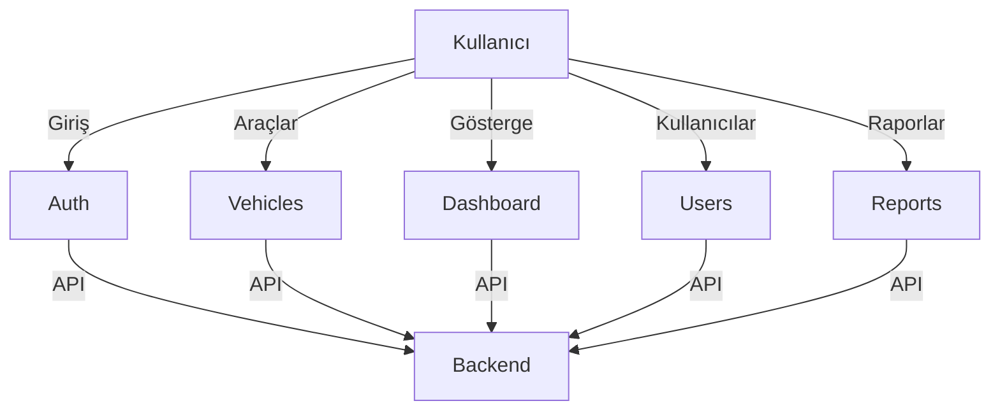

<picture>
  <source media="(prefers-color-scheme: dark)" srcset="https://user-images.githubusercontent.com/9113740/201498864-2a900c64-d88f-4ed4-b5cf-770bcb57e1f5.png">
  <source media="(prefers-color-scheme: light)" srcset="https://user-images.githubusercontent.com/9113740/201498152-b171abb8-9225-487a-821c-6ff49ee48579.png">
</picture>

<div align="center"><strong>arackira - Araç Kiralama Yönetim Paneli (Frontend)</strong></div>
<div align="center">Next.js 15 ve Shadcn-ui ile geliştirilmiş modern yönetim arayüzü</div>
<br />

## Genel Bakış

Bu proje, araç kiralama ve filo yönetimi süreçlerini dijitalleştirmek için geliştirilmiş modern bir frontend uygulamasıdır. Next.js, TypeScript ve güçlü UI bileşenleri ile kurumsal düzeyde tasarlanmıştır.

- Framework - [Next.js 15](https://nextjs.org/13)
- Language - [TypeScript](https://www.typescriptlang.org)
- Styling - [Tailwind CSS v4](https://tailwindcss.com)
- Components - [Shadcn-ui](https://ui.shadcn.com)
- Schema Validations - [Zod](https://zod.dev)
- State Management - [Zustand](https://zustand-demo.pmnd.rs)
- Search params state manager - [Nuqs](https://nuqs.47ng.com/)

- Tables - [Tanstack Data Tables](https://ui.shadcn.com/docs/components/data-table) • [Dice UI](https://www.diceui.com/docs/components/data-table)
- Forms - [React Hook Form](https://ui.shadcn.com/docs/components/form)
- Command+k interface - [kbar](https://kbar.vercel.app/)
- Linting - [ESLint](https://eslint.org)
- Pre-commit Hooks - [Husky](https://typicode.github.io/husky/)
- Formatting - [Prettier](https://prettier.io)

_If you are looking for a React admin dashboard starter, here is the [repo](https://github.com/Kiranism/react-shadcn-dashboard-starter)._

## Proje Özeti
arackira, filo yönetimi ve araç kiralama süreçlerini dijitalleştiren, modern ve kullanıcı dostu bir yönetim panelidir. Next.js tabanlı, responsive ve API tabanlıdır.

## Hızlı Başlangıç
```sh
npm install
npm run dev
```

## Teknik Yığın
- Framework: [Next.js 15](https://nextjs.org/13)
- Dil: [TypeScript](https://www.typescriptlang.org)
- Stil: [Tailwind CSS v4](https://tailwindcss.com)
- Bileşenler: [Shadcn-ui](https://ui.shadcn.com)
- Şema Doğrulama: [Zod](https://zod.dev)
- Durum Yönetimi: [Zustand](https://zustand-demo.pmnd.rs)
- Arama Parametreleri: [Nuqs](https://nuqs.47ng.com/)
- Tablo: [Tanstack Data Tables](https://ui.shadcn.com/docs/components/data-table) • [Dice UI](https://www.diceui.com/docs/components/data-table)
- Formlar: [React Hook Form](https://ui.shadcn.com/docs/components/form)
- Komut Arayüzü: [kbar](https://kbar.vercel.app/)
- Kod Kalitesi: [ESLint](https://eslint.org), [Prettier](https://prettier.io), [Husky](https://typicode.github.io/husky/)

## Dokümantasyon
Tüm teknik ve operasyonel dokümantasyon `/docs` klasöründe modüler olarak tutulmaktadır:

- [Mimari ve Akışlar](./docs/architecture.md)
- [Modüller](./docs/modules/)

### Modüller
- [Kimlik Doğrulama (Auth)](./docs/modules/auth.md)
- [Gösterge Paneli (Dashboard)](./docs/modules/dashboard.md)
- [Araç Yönetimi (Vehicles)](./docs/modules/vehicles.md)
- [Kullanıcı Yönetimi (Users)](./docs/modules/users.md)
- [Raporlama (Reports)](./docs/modules/reports.md)

## Özet Modül Akış Diyagramı

```

## Sayfa Örnekleri

| Sayfa                                      | Özellikler                                                                                                                |
| :------------------------------------------ | :------------------------------------------------------------------------------------------------------------------------ |
| [Gösterge Paneli](#)                        | Analitik kartlar, grafikler, bağımsız yükleme ve hata yönetimi.                                                           |
| [Araçlar](#)                                | Sunucu tarafı arama, filtreleme, Nuqs ile tip güvenli arama parametre yönetimi.                                           |
| [Yeni Araç](#)                              | Shadcn form (react-hook-form + zod) ile yeni araç ekleme.                                                                 |
| [Kanban Tahta](#)                           | Sürükle-bırak görev yönetimi, dnd-kit ve zustand ile local state.                                                         |
| [Bulunamadı](#)                             | Kök seviyede 404 sayfası.                                                                                                 |

## Özellik Bazlı Organizasyon


```plaintext
src/
├── app/ # Next.js App Router directory
│ ├── (auth)/ # Auth route group
│ │ ├── (signin)/
│ ├── (dashboard)/ # Dashboard route group
│ │ ├── layout.tsx
│ │ ├── loading.tsx
│ │ └── page.tsx
│ └── api/ # API routes
│
├── components/ # Shared components
│ ├── ui/ # UI components (buttons, inputs, etc.)
│ └── layout/ # Layout components (header, sidebar, etc.)
│
├── features/ # Feature-based modules
│ ├── feature/
│ │ ├── components/ # Feature-specific components
│ │ ├── actions/ # Server actions
│ │ ├── schemas/ # Form validation schemas
│ │ └── utils/ # Feature-specific utilities
│ │
├── lib/ # Core utilities and configurations
│ ├── auth/ # Auth configuration
│ ├── db/ # Database utilities
│ └── utils/ # Shared utilities
│
├── hooks/ # Custom hooks
│ └── use-debounce.ts
│
├── stores/ # Zustand stores
│ └── dashboard-store.ts
│
└── types/ # TypeScript types
└── index.ts
```

## Başlarken

> [!NOT]
> Proje **Next 15** ve **React 19** ile uyumludur. Kurulum için aşağıdaki adımları izleyin:

Depoyu klonlayın:

```
git clone https://github.com/sizin-kullanici-adiniz/arackira.git
```

- `pnpm install` (veya `npm install` / `yarn install`)
- Örnek ortam dosyasını kopyalayarak `.env.local` oluşturun:
  `cp env.example.txt .env.local`
- Gerekli ortam değişkenlerini `.env.local` dosyasına ekleyin.
- Geliştirme sunucusunu başlatın:
  `pnpm run dev`

Artık uygulamayı http://localhost:3000 adresinden erişebilirsiniz.

> [!UYARI]
> Depoyu klonladıktan veya çatalladıktan sonra, en son değişiklikleri çekerken veya senkronize ederken olası çakışmalara karşı dikkatli olun.

---

## Modül Dokümantasyonları

Aşağıda, projenin ana modüllerine ait detaylı teknik dokümantasyonlara ulaşabilirsiniz. Her dosyada ilgili modülün işlevi, temel akışları ve component yapısı özetlenmiştir:

- [Kimlik Doğrulama (Auth)](./docs/modules/auth.md): Giriş/çıkış, kullanıcı yönetimi, ProtectedRoute ve güvenlik akışları.
- [Gösterge Paneli (Dashboard)](./docs/modules/dashboard.md): Ana panel, özet veriler, grafikler ve API ile veri çekme akışı.
- [Araç Yönetimi (Vehicles)](./docs/modules/vehicles.md): Araç ekleme, düzenleme, silme, listeleme ve formlar.
- [Kullanıcı Yönetimi (Users)](./docs/modules/users.md): Kullanıcı ekleme/düzenleme, rol bazlı erişim ve yönetim.
- [Raporlama (Reports)](./docs/modules/reports.md): Rapor oluşturma, veri görselleştirme ve filtreleme akışları.

Başarılar! 🚗