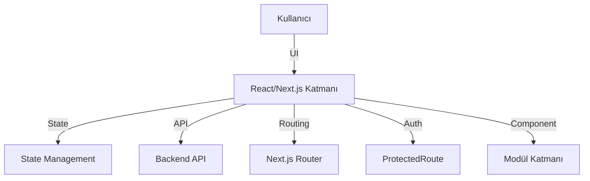

# Frontend Mimari ve Genel Akışlar

Bu doküman, frontend uygulamasının genel mimarisini ve ana veri/iş akışlarını özetler.

## Genel Mimari Diyagramı

```

## Katmanlar
- **UI Katmanı:** React componentleri, sayfalar, layoutlar
- **State Management:** Context, custom hook'lar, global store (örn. Zustand, Redux)
- **Routing:** Next.js router, protected route yapısı
- **API Katmanı:** Backend ile iletişim, fetch/axios, error handling
- **Modüller:** Auth, Dashboard, Vehicles, Users, Reports, vb.

## Modüller
| Modül         | Açıklama                             | Doküman                      |
|--------------|--------------------------------------|------------------------------|
| Auth         | Giriş/çıkış, kullanıcı yönetimi       | [Auth Modülü](./modules/auth.md) |
| Dashboard    | Ana gösterge paneli, özet veriler     | [Dashboard Modülü](./modules/dashboard.md) |
| Vehicles     | Araç yönetimi ekranları               | [Vehicles Modülü](./modules/vehicles.md) |
| Users        | Kullanıcı yönetimi arayüzü            | [Users Modülü](./modules/users.md) |
| Reports      | Raporlama ve veri görselleştirme      | [Reports Modülü](./modules/reports.md) |

## Temel Akışlar
- Kimlik doğrulama ve yetkilendirme (ProtectedRoute ile)
- API ile veri çekme ve gösterme
- Kullanıcı işlemleri ve modüller arası geçiş
