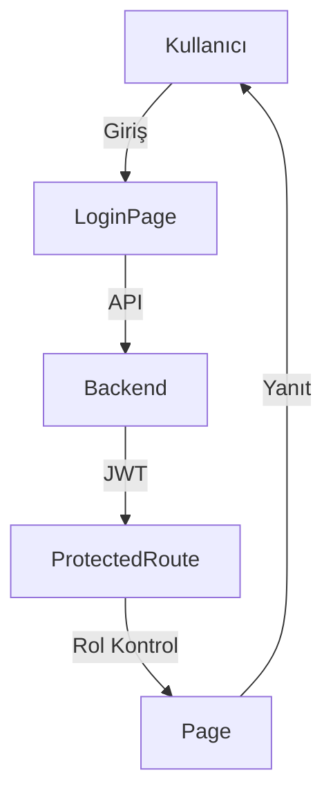

# Auth Modülü

Bu doküman, giriş/çıkış ve kullanıcı yönetimi işlevlerini, güvenlik akışlarını ve ProtectedRoute kullanımını içerir.

## Modül Özeti
- Giriş, çıkış, kayıt, şifre sıfırlama
- ProtectedRoute ile korumalı sayfalar ve rol bazlı erişim
- useAuth ve diğer custom hook'lar ile context erişimi

## Akış Diyagramı (Mermaid)

## Temel Componentler
- `LoginPage`, `RegisterPage`, `ForgotPasswordPage`
- `ProtectedRoute` (standart erişim ve rol bazlı erişim için)
- `useAuth` (context erişimi için)

## Notlar
- ProtectedRoute tüm korumalı sayfalarda kullanılmalı.
- useAuth ve diğer custom hook'lar `src/hooks` klasöründe tutulmalı.
