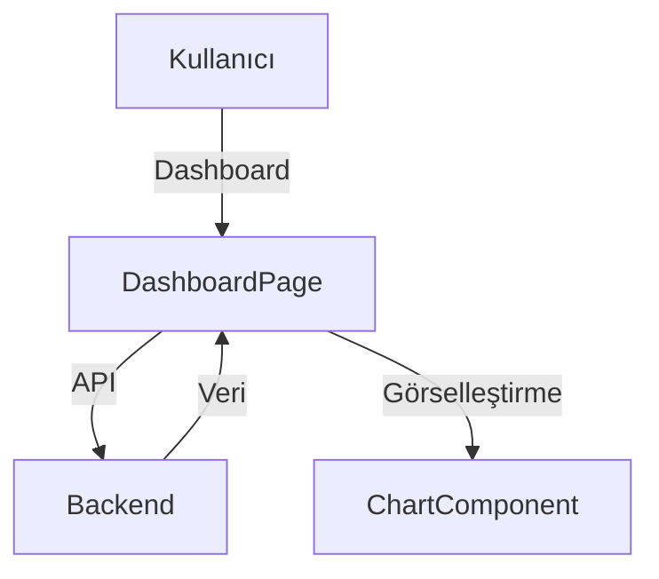

# Dashboard Modülü

Bu doküman, ana gösterge paneli ve özet veri akışlarını içerir.

## Modül Özeti
- Özet veriler, grafikler, hızlı aksiyonlar
- API ile veri çekme ve görselleştirme

## Akış Diyagramı (Mermaid)

## Temel Componentler
- `DashboardPage`, `ChartComponent`, `StatsCard`

## Notlar
- Dashboard verileri API'den çekilmeli, loading ve error state'leri gösterilmeli.
