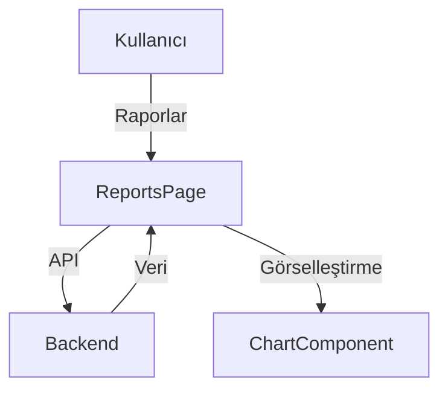

# Reports Modülü

Bu doküman, raporlama ve veri görselleştirme işlevlerini içerir.

## Modül Özeti
- Rapor oluşturma, grafik ve tablo ile veri sunumu
- API ile veri çekme ve filtreleme

## Akış Diyagramı (Mermaid)

## Temel Componentler
- `ReportsPage`, `ChartComponent`, `ReportFilter`

## Notlar
- Raporlar için loading, error ve filtreleme state'leri iyi yönetilmeli.
