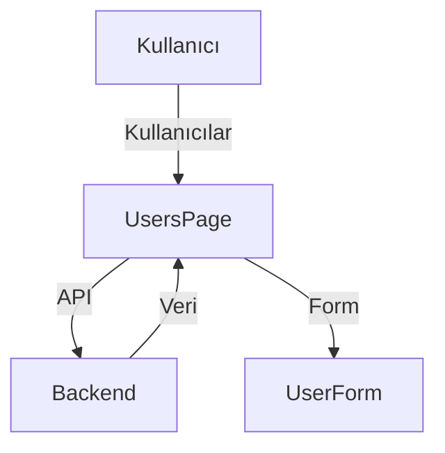

# Users Modülü

Bu doküman, kullanıcı yönetimi arayüzü ve akışlarını içerir.

## Modül Özeti
- Kullanıcı ekleme, düzenleme, silme, listeleme
- Rol bazlı erişim ve yönetim

## Akış Diyagramı (Mermaid)

## Temel Componentler
- `UsersPage`, `UserForm`, `UserList`

## Notlar
- Kullanıcı işlemleri için ProtectedRoute ve rol kontrolü uygulanmalı.
