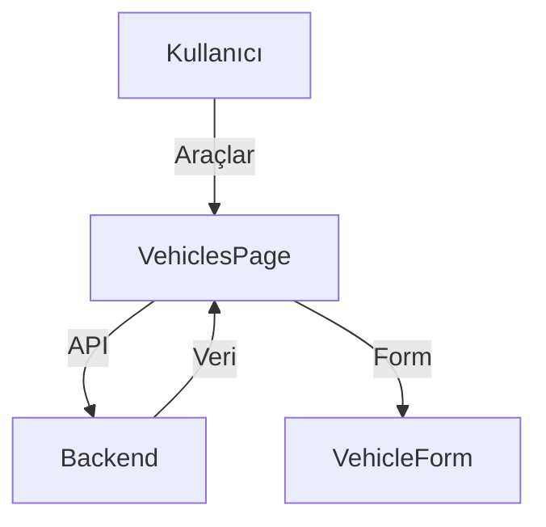

# Vehicles Modülü

Bu doküman, araç yönetimi arayüzü ve akışlarını içerir.

## Modül Özeti
- Araç ekleme, düzenleme, silme, listeleme
- API ile veri çekme ve güncelleme

## Akış Diyagramı (Mermaid)

## Temel Componentler
- `VehiclesPage`, `VehicleForm`, `VehicleList`

## Notlar
- Tüm API çağrıları error handling ile yapılmalı.
- Formlar validasyon içermeli.
